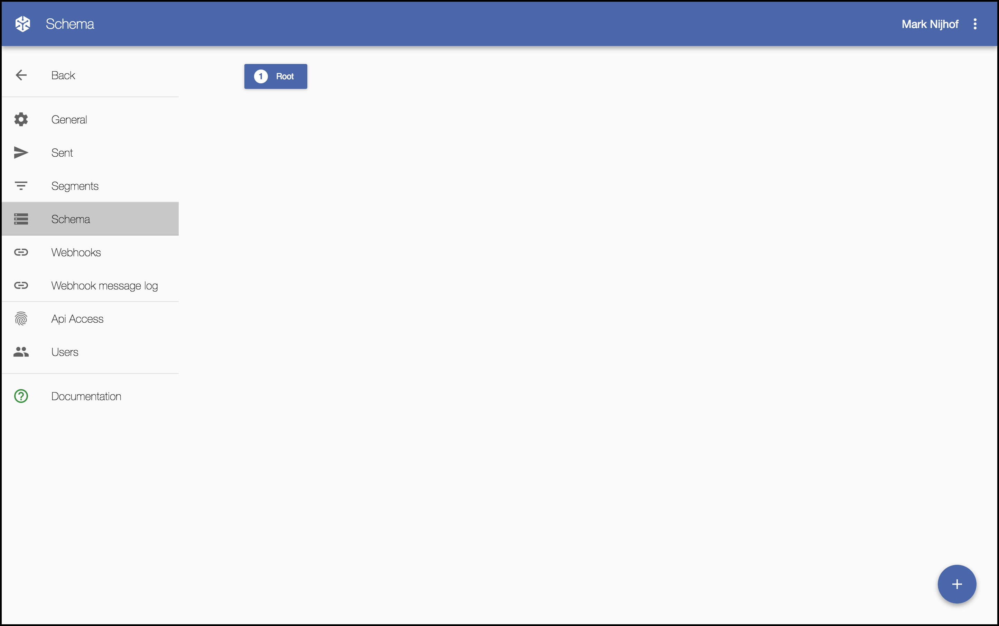
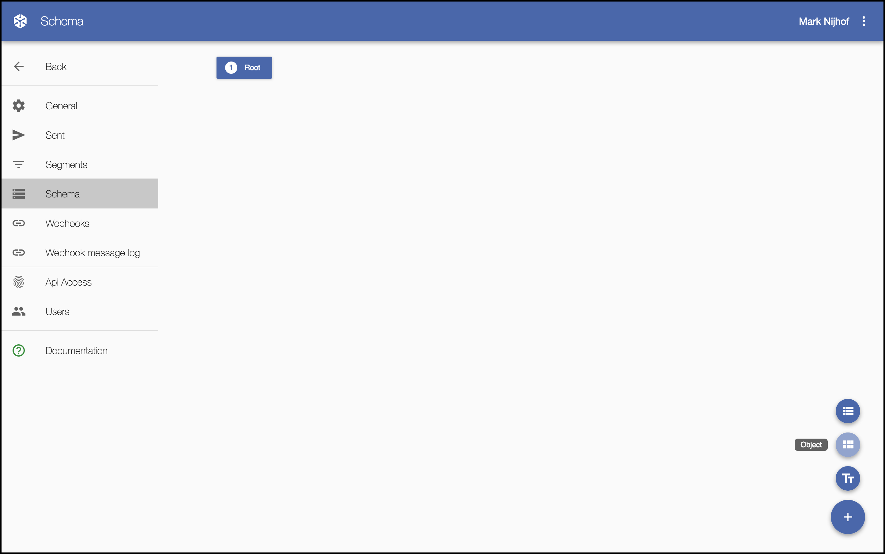
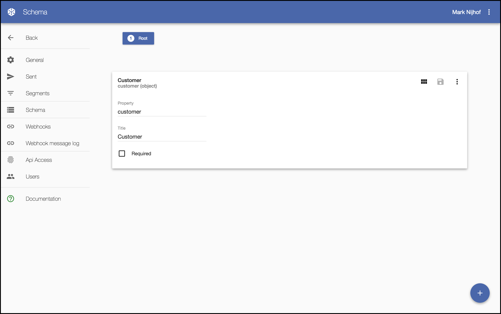
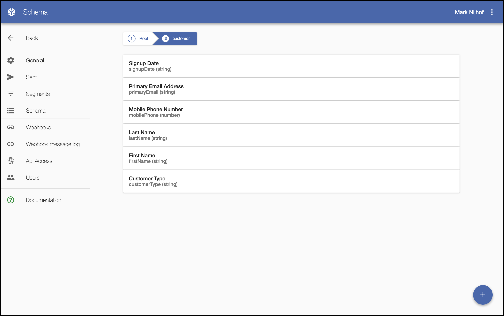

Configuring Snowflake
=====================

Because your data is such an important part of how you work with Snnowflake we will start with descibing how the data will look like. The Snowflake solution uses this description in nearly all parts, from the message templates and configuring what message variant to use till building dynamic segments.

Describing the data
-------------------

We are going to describe how a simple customer may look, in our example we will use a customer that has a fist name, last name, email address, mobile phone number, a signup date and a customer type. So let's see how we go about describing this in the Snowflake UI.

### The schema editor

Login to Snowflake and navigate to [the schema page under admin](https://app.snowflake.ai/#/admin/schema) the screen should look like this

### Add an object

Then move the mouse over the round plus button in the lower right corner and select to add an object. This will add an object element to the screen.

### Provide object details

When you then click on the small bar it will expand and there you can provide the details for this object. In our case this will be an object with the name customer. Now you can see both a *property* and a *title*. The value in *property* is how it is called in the data, and the *title* is what we will use in the different Snowflake UI parts. This enables you to provide a nicer description.

### Add the individual customer properties

So when you are done you click save and after that you click the little square icon next to the save button. This will navigate you inside the customer object. There you again use the round plus button in the lower right corner, but now you will want to add a *field* instead.

As you can see we have a few more options now, the same applies to the *property* and *title* fields, but you can now also specify what the *property type* is, and this can be either a string, boolean, integer or number. And if you choose it to be a string then you can also specify a *format* and this means you can specify it to be either *not set*, *email*, *date-time* or an *url*. It is important to specify when the data is a date time value, and that this is in ISO format (`"2010-09-15T18:55:32Z"`) in order to be able to filter on it.

### Done

So that's it, we have now described how our simple customer looks like. This may seem like a bit complicated, but I promise the benefits will be well worth it later when a non-technical person can just start creating segments themselves without having to ask for techical help.

In this example we kept the structure really simple, but in a real scenario you will probably have more complex objects and even lists of objects that themselves again contain other lists. Think for example about a list with all the products a customer has and that each product could have a list with addons. Describing such complex data structures is a breeze in Snowflake. If you want to see a more detailed description then go to [the schema edditor](../features/#the-schema-editor) description.
